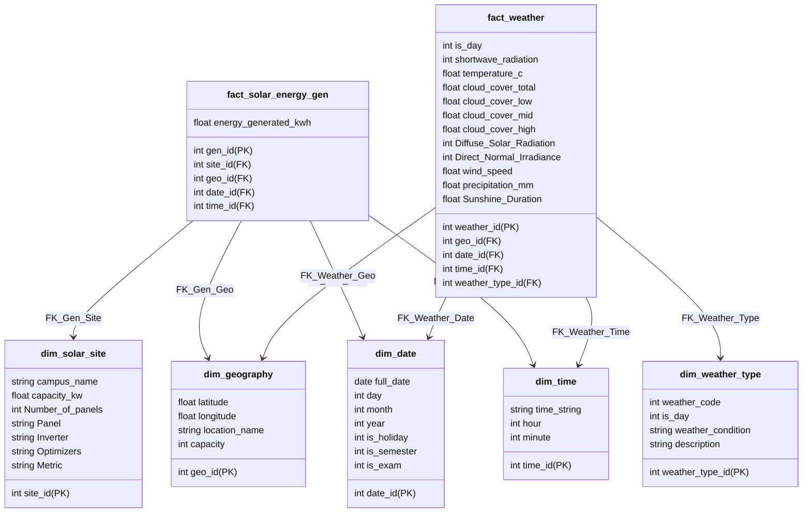
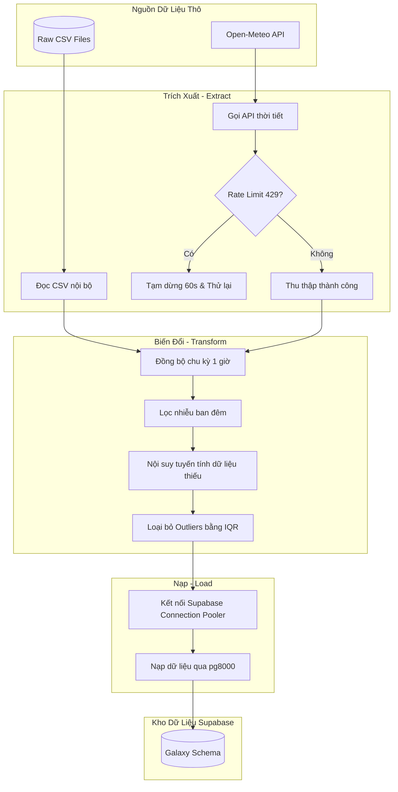

# Phân tích Hiệu suất và Dự báo Sản lượng Hệ thống Điện Mặt Trời

> [!NOTE]
> Dự án tốt nghiệp Chuyên ngành Xử lý Dữ liệu — Trường Cao đẳng FPT Polytechnic (Cơ sở TP. Hồ Chí Minh).  
> **Nhóm thực hiện:** **The Outliers**  
> **Giảng viên hướng dẫn:** Văn Công Khanh

---

## 📌 Mục lục (Table of Contents)
* [1. Giới thiệu Dự án](#1-giới-thiệu-dự-án)
* [2. Kiến trúc Kho dữ liệu (Data Warehouse)](#2-kiến-trúc-kho-dữ-liệu-data-warehouse)
* [3. Quy trình ETL và Chuẩn hóa Dữ liệu](#3-quy-trình-etl-và-chuẩn-hóa-dữ-liệu)
* [4. Các Insight Kinh doanh và Phân tích chuyên sâu (Business Insights)](#4-các-insight-kinh-doanh-và-phân-tích-chuyên-sâu-business-insights)
* [5. Cấu trúc Thư mục Dự án](#5-cấu-trúc-thư-mục-dự-án)
* [6. Hướng dẫn Cài đặt và Sử dụng](#6-hướng-dẫn-cài-đặt-và-sử-dụng)
* [7. Quy chuẩn đặt tên tệp tin (File Naming Conventions)](#7-quy-chuẩn-đặt-tên-tệp-tin-file-naming-conventions)
* [8. Quy tắc Commit Git và Quản lý Dự án](#8-quy-tắc-commit-git-và-quản-lý-dự-án)

---

## 1. Giới thiệu Dự án
Dự án nhằm mục đích xây dựng một hệ thống phân tích và xử lý dữ liệu toàn diện để phát hiện, xử lý các bất thường và dự báo sản lượng phát điện của 42 trạm điện quang điện (PV) tại Úc. Bằng cách tích hợp dữ liệu vận hành thực tế cùng dữ liệu khí tượng viễn thám từ Open-Meteo, dự án hỗ trợ các nhà quản lý tối ưu hóa hiệu suất vận hành, lên kế hoạch bảo trì chủ động và giảm thiểu rủi ro tài chính.

### Mục tiêu cốt lõi:
1. **Thiết kế Kho dữ liệu đa chiều (Data Warehouse)** tích hợp đồng bộ dữ liệu thời tiết và sản lượng.
2. **Xây dựng Pipeline ETL tự động** làm sạch, lọc nhiễu ban đêm, xử lý dữ liệu khuyết thiếu và giải quyết lệch pha tần suất dữ liệu (Granularity Mismatch).
3. **Khám phá Dữ liệu (EDA) và Phân tích Insight** về tác động của thời tiết (nhiệt độ, mây che phủ) đến hiệu suất tấm pin.
4. **Huấn luyện các mô hình dự báo Baseline** (ARIMA, Prophet) phục vụ bảo trì dự đoán.
5. **Trực quan hóa Dashboard** trực quan sinh động trên Tableau.

---

## 2. Kiến trúc Kho dữ liệu (Data Warehouse)
Hệ thống lưu trữ trên nền tảng **Supabase (PostgreSQL)** sử dụng kiến trúc **Lược đồ Thiên hà (Galaxy Schema / Fact Constellation)** để đồng thời phục vụ hai bảng sự kiện có tần suất dữ liệu khác nhau (Sản lượng: 15 phút, Thời tiết: 1 giờ).

### Sơ đồ cấu trúc cơ sở dữ liệu (Database Schema Diagram)



Sơ đồ bảng chi tiết xem tại file thiết kế hệ thống [create_table.sql](file:///D:/Learning/FPT_polytechnic/Sem6/datn_outlier_hs_nlmt/src/database/create_table.sql).

### Bảng Dimension (Chiều dùng chung):
* [dim_solar_site](file:///D:/Learning/FPT_polytechnic/Sem6/datn_outlier_hs_nlmt/src/database/create_table.sql#L7-L16): Thông tin kỹ thuật trạm (Số tấm pin, Inverter, Công suất cực đại kWp...).
* [dim_geography](file:///D:/Learning/FPT_polytechnic/Sem6/datn_outlier_hs_nlmt/src/database/create_table.sql#L18-L25): Tọa độ địa lý (Vĩ độ, kinh độ, tên khu vực).
* [dim_date](file:///D:/Learning/FPT_polytechnic/Sem6/datn_outlier_hs_nlmt/src/database/create_table.sql#L27-L37): Trục ngày (ngày, tháng, năm, cờ ngày lễ/học kỳ/kỳ thi).
* [dim_time](file:///D:/Learning/FPT_polytechnic/Sem6/datn_outlier_hs_nlmt/src/database/create_table.sql#L39-L45): Trục giờ (chu kỳ 15 phút).
* [dim_weather_type](file:///D:/Learning/FPT_polytechnic/Sem6/datn_outlier_hs_nlmt/src/database/create_table.sql#L47-L54): Phân loại mã thời tiết WMO và ngày/đêm.

### Bảng Fact (Sự kiện):
* [fact_solar_energy_gen](file:///D:/Learning/FPT_polytechnic/Sem6/datn_outlier_hs_nlmt/src/database/create_table.sql#L61-L75): Đo lường sản lượng điện thực tế phát ra (`energy_generated_kwh`).
* [fact_weather](file:///D:/Learning/FPT_polytechnic/Sem6/datn_outlier_hs_nlmt/src/database/create_table.sql#L77-L103): Lưu trữ các thông số thời tiết (nhiệt độ, bức xạ sóng ngắn, mây che phủ, lượng mưa, tốc độ gió...).

---

## 3. Quy trình ETL và Chuẩn hóa Dữ liệu

### Sơ đồ luồng xử lý dữ liệu (Data Pipeline Flow)



### Chi tiết các bước:
1. **Trích xuất (Extract)**:
   * Dữ liệu sản lượng trạm được đọc từ các tệp CSV gốc.
   * Dữ liệu thời tiết được gọi tự động từ **Open-Meteo Archive API** sử dụng tọa độ của 42 trạm. Mã nguồn tích hợp cơ chế bắt lỗi giới hạn lượt truy cập (Rate Limit - HTTP 429) tự dừng 60 giây và thử lại để đảm bảo pipeline ổn định.

2. **Biến đổi (Transform)**:
   * **Xử lý lệch pha dữ liệu:** Quy trình tự động gom cụm dữ liệu sản lượng (từ 15 phút lên 1 giờ) để đồng bộ hóa hoàn toàn với dữ liệu thời tiết phục vụ mô hình học máy.
   * **Lọc nhiễu ban đêm (Night Noise Filter):** Loại bỏ sản lượng điện ảo ghi nhận vào ban đêm do rò rỉ dòng điện hoặc nhiễu thiết bị cảm biến (khi bức xạ mặt trời = 0).
   * **Nội suy (Interpolation):** Sử dụng phương pháp nội suy tuyến tính để điền các khoảng trống dữ liệu thời tiết bị khuyết thiếu.
   * **Phát hiện bất thường (Outliers):** Áp dụng phương pháp khoảng tứ phân vị (IQR) để loại bỏ các điểm đột biến nhiễu của cảm biến.

3. **Nạp (Load)**:
   * Dữ liệu sau khi làm sạch được nạp vào Supabase thông qua thư viện kết nối **`pg8000`** (Pure Python, giúp chạy ổn định trên mọi môi trường và hệ điều hành).
   * Sử dụng kết nối qua **Supabase Connection Pooler** giúp quản lý luồng tải đồng thời hiệu quả từ nhiều thành viên nhóm mà không bị quá tải kết nối.

---

## 4. Các Insight Kinh doanh và Phân tích chuyên sâu (Business Insights)

> [!TIP]
> * **Hiện tượng suy hao do nhiệt (Thermal Degradation):** Dữ liệu cho thấy khi nhiệt độ môi trường vượt quá $25^\circ\text{C}$, hiệu suất chuyển đổi của các tấm pin PV bị suy giảm mạnh. Đây là lý do tại sao công suất buổi trưa có bức xạ cao nhất nhưng sản lượng điện thực tế đôi khi không đạt đỉnh kỳ vọng.
> * **Độ nhiễu ban đêm và Dòng rò (Night Noise):** Phát hiện dòng điện rò rỉ nhẹ tại một số trạm vào khung giờ đêm ($18\text{h} - 5\text{h}$). Nếu không lọc bỏ trong pha ETL, tổng sản lượng báo cáo hàng năm sẽ bị sai lệch lũy kế.
> * **Dự báo Baseline để Bảo trì Dự đoán (Predictive Maintenance):** Sử dụng mô hình ARIMA và Prophet để thiết lập sản lượng dự kiến (đường cơ sở). Nếu sản lượng thực tế sụt giảm đáng kể so với baseline trong khi bức xạ vẫn cao, hệ thống sẽ tự động phát tín hiệu cảnh báo tấm pin bị bám bụi bẩn nặng hoặc Inverter bị lỗi để cử đội kỹ thuật xử lý.

---

## 5. Cấu trúc Thư mục Dự án

```
datn_outlier_hs_nlmt/
├── commit_helper.py          <- Script hỗ trợ kiểm tra định dạng Git commit
├── data/                     <- Thư mục chứa dữ liệu dự án
│   ├── processed/            <- Dữ liệu sạch đầu ra sau tiền xử lý
│   └── raw/                  <- Dữ liệu gốc thu thập ban đầu
├── docker-compose.yaml       <- Cấu hình môi trường dịch vụ Docker (ví dụ: DB)
├── docs/                     <- Tài liệu hướng dẫn và báo cáo theo tiến độ Scrum
│   ├── configurations_and_setups/ <- Tài liệu cấu hình và cài đặt môi trường
│   ├── scrum_5_pipeline_foundation/ <- Báo cáo và tài liệu giai đoạn Scrum 5
│   ├── scrum_6_business_logic_eda/  <- Báo cáo và tài liệu giai đoạn Scrum 6
│   ├── scrum_7_visualization_forecasting/ <- Báo cáo và tài liệu giai đoạn Scrum 7
│   └── scrum_8_project_delivery_defense/  <- Báo cáo và tài liệu giai đoạn Scrum 8
├── Makefile                  <- Script tự động hóa các tác vụ phát triển (make setup, make run, etc.)
├── mkdocs.yml                <- Cấu hình tạo trang tài liệu tĩnh MkDocs
├── notebooks/                <- Jupyter notebooks phục vụ nghiên cứu và crawl dữ liệu
│   ├── 01_crawl_latrobe.ipynb <- Notebook crawl dữ liệu trạm Latrobe
│   └── 02_crawl_vietnam.ipynb <- Notebook crawl dữ liệu thời tiết Việt Nam
├── pyproject.toml            <- Cấu hình cài đặt package và dependency của dự án
├── references/               <- Các tài liệu tham khảo và đặc tả API
│   ├── api_docs/             <- Tài liệu API
│   └── research_papers/      <- Các bài báo nghiên cứu khoa học liên quan
├── reports/                  <- Báo cáo tốt nghiệp chính thức và slide
│   ├── dashboards/           <- Thiết kế dashboard trực quan hóa
│   ├── figures/              <- Các hình ảnh, biểu đồ vẽ từ dữ liệu
│   ├── official_thesis/      <- Báo cáo luận văn chính thức
│   ├── DATN_OUTLIERS_REPORT.tex <- File nguồn LaTeX của báo cáo tốt nghiệp
│   ├── DATN_OUTLIERS_REPORT.pdf <- File báo cáo PDF (biên dịch từ LaTeX)
│   └── DATN_OUTLIERS_REPORT_V1.pdf <- Phiên bản 1 của báo cáo PDF
├── requirements.txt          <- Danh sách các thư viện Python cần cài đặt
├── src/                      <- Mã nguồn lõi (package) của dự án
│   ├── __init__.py           <- Khởi tạo package
│   ├── config.py             <- Cấu hình tham số hệ thống và môi trường
│   ├── database.py           <- Các hàm kết nối và truy vấn cơ sở dữ liệu
│   ├── dataset.py            <- Tiền xử lý và chuẩn bị dataset cho mô hình
│   ├── features.py           <- Trích xuất và biến đổi đặc trưng (Feature Engineering)
│   ├── plots.py              <- Mã nguồn vẽ biểu đồ phân tích dữ liệu
│   ├── database/             <- Cơ sở dữ liệu và cấu trúc lưu trữ
│   │   ├── create_table.sql  <- Lược đồ SQL khởi tạo các bảng trên Supabase
│   │   └── supabase_storage.py <- Công cụ đồng bộ lưu trữ tệp lên Cloud Storage
│   ├── etl/                  <- Các luồng xử lý trích xuất, biến đổi và nạp dữ liệu (ETL)
│   │   ├── pipeline/         <- Pipeline nạp dữ liệu chính vào Kho dữ liệu
│   │   │   ├── load_01_dims.py   <- ETL nạp dữ liệu vào bảng Dimension
│   │   │   ├── load_02_facts.py  <- ETL nạp dữ liệu vào bảng Fact
│   │   │   └── load_03_verify.py <- Kiểm tra, đối soát và xác thực dữ liệu sau nạp
│   │   └── upload_dataraw/   <- Các công cụ kiểm tra và tải dữ liệu thô
│   │       ├── CHECKLIST.md  <- Danh sách kiểm tra chất lượng dữ liệu thô
│   │       ├── check_docker.sh   <- Kịch bản kiểm tra dịch vụ Docker
│   │       ├── check_mapping.py  <- Kiểm tra ánh xạ giữa các nguồn dữ liệu
│   │       ├── check_null.py     <- Thống kê tỷ lệ giá trị bị thiếu (Null)
│   │       ├── upload_raw.py     <- Tải dữ liệu thô lên Cloud
│   │       └── verify_upload.py  <- Xác thực tính toàn vẹn của tệp đã tải
│   └── modeling/             <- Thư mục chứa các mô hình học máy
│       ├── __init__.py       <- Khởi tạo package modeling
│       ├── predict.py        <- Dự báo sản lượng điện mặt trời
│       └── train.py          <- Huấn luyện mô hình
└── tests/                    <- Các ca kiểm thử đơn vị (Unit Tests)
    ├── test_db_connection.py <- Kiểm tra kết nối tới cơ sở dữ liệu
    └── test_insert_csv.py    <- Kiểm tra việc nạp dữ liệu từ tệp CSV
```

---

## 6. Hướng dẫn Cài đặt và Sử dụng

> [!IMPORTANT]
> Dự án yêu cầu phiên bản **Python 3.11+** được cấu hình sẵn trên máy.

### Bước 1: Tạo môi trường ảo (Virtual Environment)

**Windows:**
```powershell
py -m venv .venv
```

**Linux / macOS:**
```bash
python3 -m venv .venv
```

### Bước 2: Kích hoạt môi trường ảo

**Windows (Command Prompt):**
```cmd
.venv\Scripts\activate.bat
```

**Windows (PowerShell):**
```powershell
.venv\Scripts\Activate.ps1
```
*Lưu ý: Nếu PowerShell báo lỗi phân quyền, chạy lệnh sau trước rồi kích hoạt lại:*
```powershell
Set-ExecutionPolicy -ExecutionPolicy RemoteSigned -Scope CurrentUser
```

**Linux / macOS:**
```bash
source .venv/bin/activate
```

Khi kích hoạt thành công, bạn sẽ thấy ký hiệu `(.venv)` ở đầu dòng lệnh.

### Bước 3: Cài đặt các thư viện phụ thuộc

Cài đặt tất cả các gói thư viện bao gồm các thư viện ETL, CSDL, máy học, và chế độ gói tự chỉnh sửa (`-e .`):
```bash
pip install -r requirements.txt
```

### Bước 4: Chạy Pipeline ETL nạp dữ liệu vào Supabase
1. Tạo tệp cấu hình `.env` dựa trên [env.example](file:///D:/Learning/FPT_polytechnic/Sem6/datn_outlier_hs_nlmt/.env.example) và điền thông tin kết nối Supabase của bạn.
2. Khởi tạo cấu trúc các bảng dữ liệu:
   Sơ đồ bảng được định nghĩa tại [create_table.sql](file:///D:/Learning/FPT_polytechnic/Sem6/datn_outlier_hs_nlmt/src/database/create_table.sql). Bạn có thể kiểm tra kết nối DB bằng cách chạy:
   ```bash
   python tests/test_db_connection.py
   ```
3. Chạy ETL tải các bảng Dimension:
   ```bash
   python src/etl/pipeline/load_01_dims.py
   ```
4. Chạy ETL tải các bảng Fact:
   ```bash
   python src/etl/pipeline/load_02_facts.py
   ```
5. Chạy xác thực dữ liệu:
   ```bash
   python src/etl/pipeline/load_03_verify.py
   ```

### Bước 5: Hủy kích hoạt môi trường ảo (khi hoàn thành)
```bash
deactivate
```

---

## 7. Quy chuẩn đặt tên tệp tin (File Naming Conventions)
Để đảm bảo dự án được quản lý một cách khoa học, thống nhất, dễ tìm kiếm và tránh xung đột khi làm việc nhóm, toàn bộ thành viên cần tuân thủ nghiêm ngặt các quy tắc đặt tên file dưới đây:

### 7.1 Nguyên tắc chung:
* **Không dùng dấu tiếng Việt, không dùng khoảng trắng (Space).**
* **Sử dụng chữ thường (lowercase) và dấu gạch dưới (`_`)** để phân tách các từ (snake_case), trừ các trường hợp đặc biệt được quy định dưới đây.
* **Tên file ngắn gọn nhưng phải phản ánh rõ nội dung và mục đích.**

### 7.2 Quy chuẩn theo từng loại tệp tin:

1. **Dữ liệu thô và đã xử lý (`data/`):**
   * **Dữ liệu thô (`data/raw/`):** `<data_source>_<site_name/region>_<time_range>_raw.<extension>`
     * *Ví dụ:* `solar_gen_bundoora_2020_2022_raw.csv` (Sản lượng điện), `open_meteo_weather_bendigo_2023_raw.csv` (Thời tiết từ API).
   * **Dữ liệu trung gian/sạch (`data/interim/` & `data/processed/`):** `<data_type>_<granularity>_<status_description>.<extension>`
     * *Ví dụ:* `weather_hourly_cleaned.csv` (Thời tiết theo giờ đã nội suy), `solar_gen_hourly_aggregated.csv` (Sản lượng gom cụm theo giờ).

2. **Sổ tay nghiên cứu (`notebooks/`):**
   * **Quy chuẩn:** Đánh số thứ tự tăng dần theo tiến trình phân tích khám phá + Tên ngắn gọn mô tả tác vụ.
   * **Định dạng:** `<sequence_number>_<main_task>_<detail>.ipynb` (Sử dụng hai chữ số ở đầu: `01_`, `02_`, `03_`...).
     * *Ví dụ:* `01_eda_solar_generation.ipynb` (Khám phá sản lượng điện thô), `03_model_arima_baseline.ipynb` (Xây dựng mô hình ARIMA baseline).

3. Kịch bản ETL và Tiện ích (`src/etl/pipeline/` & `src/etl/upload_dataraw/`):
   * **Kịch bản ETL (`src/etl/pipeline/`):** Đánh số thứ tự luồng xử lý và chỉ định rõ Dimension (`dims`) hay Fact (`facts`).
     * *Ví dụ:* [load_01_dims.py](file:///D:/Learning/FPT_polytechnic/Sem6/datn_outlier_hs_nlmt/src/etl/pipeline/load_01_dims.py), [load_02_facts.py](file:///D:/Learning/FPT_polytechnic/Sem6/datn_outlier_hs_nlmt/src/etl/pipeline/load_02_facts.py), [load_03_verify.py](file:///D:/Learning/FPT_polytechnic/Sem6/datn_outlier_hs_nlmt/src/etl/pipeline/load_03_verify.py).
   * **Kịch bản chất lượng / công cụ hỗ trợ:** `<action>_<target>.py`
     * *Ví dụ:* `check_null.py`, `check_mapping.py`, `verify_upload.py`.

4. **Mô hình học máy (`models/`):**
   * **Quy chuẩn:** Tên mô hình + Đối tượng dự báo + Phiên bản (Version) + Ngày lưu (YYYYMMDD).
   * **Định dạng:** `<model_name>_<target>_v<version>_<date>.<extension>`
     * *Ví dụ:* `prophet_solar_gen_v1.0_20260603.pkl`, `arima_solar_gen_v1.1_20260604.pkl`.

5. **Báo cáo, Tài liệu đồ án (`reports/`):**
   * **Báo cáo chính LaTeX / PDF:**
     * File báo cáo gốc: `DATN_OUTLIERS_REPORT.tex` (Giữ nguyên tên gốc cố định để không hỏng luồng biên dịch).
     * File xuất bản (PDF): `DATN_OUTLIERS_REPORT_v<version>_date_<DDMMYYYY>.pdf`
       * *Ví dụ:* `DATN_OUTLIERS_REPORT_v1.0_date_03062026.pdf`
   * **Slide thuyết trình / Tài liệu phụ:** `<document_name>_v<version>.<extension>`
     * *Ví dụ:* `Slide_DATN_Outliers_v1.0.pptx`, `Poster_DATN_Outliers_v1.0.pdf`.

---

## 8. Quy tắc Commit Git và Quản lý Dự án
Nhóm áp dụng quy tắc commit nghiêm ngặt theo định dạng Angular commit convention:
```
<type>(<scope>): [JIRA-KEY] <subject>
```

**Ví dụ:** `feat(db): [SCRUM-40] add local ETL pipeline and supabase storage connector`

*Bạn có thể sử dụng bộ hỗ trợ commit tích hợp sẵn tại file [commit_helper.py](file:///D:/Learning/FPT_polytechnic/Sem6/datn_outlier_hs_nlmt/commit_helper.py) để kiểm tra tính hợp lệ trước khi đẩy mã nguồn lên GitHub.*
